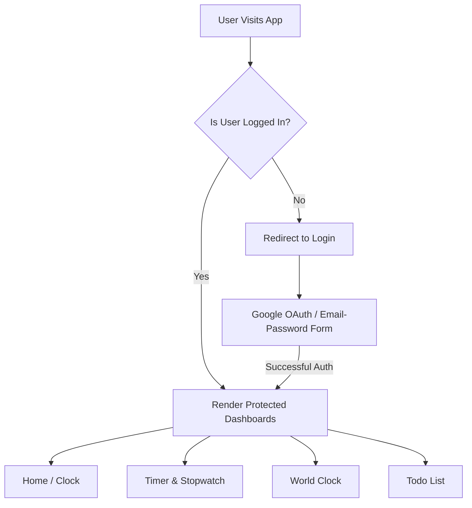

# ORA - Modern React Utilities Dashboard

[](https://react.dev/)
[](https://vite.dev/)
[](https://tailwindcss.com/)
[](https://firebase.google.com/)
[](https://reactrouter.com/)

**ORA** is an elegant, premium utility dashboard featuring real-time timekeeping tools, a timezone tracker, a task manager, and robust secure authentication. Built as a practical implementation of a comprehensive React engineering curriculum, ORA integrates modern patterns including React 19, Tailwind CSS v4, React Router v7, and Firebase Authentication.

---

## 🚀 Live Demo & Key Features

ORA brings together a suite of essential utility applications in a unified, secured space:

| Feature | Description | Key Code & Hooks |
| :--- | :--- | :--- |
| 🕒 **Digital Clock** | A bold, real-time 12-hour format digital clock showing AM/PM and the full calendar date. | `useEffect`, `setInterval` |
| ⌛ **Countdown Timer** | High-precision timer accepting custom inputs (HH:MM:SS) with visual state-alerts. | `useState`, `setInterval` |
| ⏱️ **Stopwatch** | Precision count-up clock featuring start, stop, and reset actions. | `useState`, cleanups |
| 🌐 **World Clock** | Real-time timezone tracker displaying current times across major cities (Delhi, London, NY, Tokyo, Sydney, Dubai). | `useCallback`, `toLocaleTimeString` |
| 📝 **Task Manager (Todo)**| Advanced task organizer supporting inline-editing, completion toggles, state filtering (All/Active/Completed), and `localStorage` persistence. | `localStorage`, state-lifting |
| 🔐 **Secure Gate (Auth)** | Multi-channel authentication using Google OAuth Popups or Email/Password credentials. | Firebase Auth, `onAuthStateChanged` |

---

## 🎨 Design & Theme

The project relies on a clean, modern aesthetic centered around the **Google Blue (`#0b57d0`)** palette:
- **Clean Forms & Validation**: Custom error reporting, active input highlights, and toggleable password visibility.
- **Glassmorphic Layouts**: Shadows and borders styled with Tailwind CSS v4 for a premium, lightweight feel.
- **Micro-Animations**: Hover states, smooth transition delays on custom buttons, and dynamic color-swapping depending on whether timers are active.

---

## 🛠️ Tech Stack & Key Configurations

### 1. React 19
Leverages advanced React rendering concepts, including the hook ecosystem (`useState`, `useEffect`, `useContext`, `useCallback`) and derived state calculation patterns.

### 2. Tailwind CSS v4 (Beta/Vite Compiler Integration)
Configured using the new, ultra-fast `@tailwindcss/vite` plugin setup in `vite.config.js` and imported natively:
```css
/* src/index.css */
@import "tailwindcss";
```

### 3. Firebase Authentication
Configured to handle user session states dynamically using the `onAuthStateChanged` observer inside the custom React Context:
```javascript
// src/context/AuthContext.jsx
useEffect(() => {
  const unsubscribe = onAuthStateChanged(auth, (currentUser) => {
    setUser(currentUser);
  });
  return () => unsubscribe();
}, []);
```

### 4. React Router v7 Routing
Uses nested routing structures with custom security guards (`ProtectedRoute` / `PublicRoute`):
- `/login`: Public page (redirects to `/` if user session exists).
- `/`, `/timer`, `/stopwatch`, `/worldclock`, `/todo`: Protected pages wrapped inside `MainLayout` (require an active user session, redirect to `/login` otherwise).

---

## 📁 Project Architecture

The directory follows a highly structured, feature-based architecture ensuring separation of concerns:

```bash
src/
├── Pages/
│   ├── Home/
│   │   └── Home.jsx          # Default landing, renders Clock component
│   ├── Login/
│   │   └── Login.jsx         # Sign-In form supporting Email/Pass & Google OAuth
│   ├── StopWatch/
│   │   └── StopWatch.jsx     # Stopwatch application with standard controls
│   ├── Timer/
│   │   └── Timer.jsx         # Input-driven countdown timer page
│   ├── Todo/
│   │   └── Todo.jsx          # LocalStorage-backed master list container
│   └── WorldClock/
│       └── WorldClock.jsx    # Cities configurations and grid renderer
├── Routes/
│   └── AppRoutes.jsx         # Centralized React Router configuration
├── components/
│   ├── Clock/
│   │   └── Clock.jsx         # Massive digital clock rendering component
│   ├── Navbar/
│   │   └── Navbar.jsx        # Navigation bar header with logout callback
│   ├── ProtectedRoute/
│   │   └── ProtectedRoute.jsx# Gatekeeper protecting internal pages
│   ├── PublicRoute/
│   │   └── PublicRoute.jsx   # Redirects logged-in users away from Login page
│   ├── Todo/
│   │   ├── TodoInput/
│   │   │   └── TodoInput.jsx # Input field supporting Add Task and Enter key actions
│   │   └── TodoItem/
│   │       └── TodoItem.jsx  # Individual task row with edit/delete triggers
│   └── WorldClockCard/
│       └── WorldClockCard.jsx# Self-updating timezone card component
├── context/
│   └── AuthContext.jsx       # App-wide authentication state provider
├── firebase/
│   └── firebase.js           # Firebase app initialization and auth instances
├── hooks/
│   └── useAuth.js            # Consumer hook wrapping AuthContext
├── layouts/
│   └── MainLayout.jsx        # Layout holding the common Navbar and pages Outlet
├── index.css                 # Import Tailwind CSS utilities
└── main.jsx                  # Application root & wrappers entrypoint
```

---

## 📖 Educational Context (Curriculum Covered)

This project maps directly to the lessons outlined in [topic_covered.md](file:///Users/yashaswigusain/Documents/Projects/Ora/topic_covered.md). Below is the alignment mapping for learning purposes:

| Curriculum Chapter | Key Concepts Implemented | Implementation Files |
| :--- | :--- | :--- |
| **Ch. 3: Props** | Lifting State Up, Reusable Layouts | [TodoInput.jsx](file:///Users/yashaswigusain/Documents/Projects/Ora/src/components/Todo/TodoInput/TodoInput.jsx), [TodoItem.jsx](file:///Users/yashaswigusain/Documents/Projects/Ora/src/components/Todo/TodoItem/TodoItem.jsx) |
| **Ch. 4: State & Forms** | Derived States, Controlled Form Objects | [Login.jsx](file:///Users/yashaswigusain/Documents/Projects/Ora/src/Pages/Login/Login.jsx) |
| **Ch. 6: useEffect** | Timeouts, Intervals, Cleanup, Memory Leaks | [Clock.jsx](file:///Users/yashaswigusain/Documents/Projects/Ora/src/components/Clock/Clock.jsx), [Timer.jsx](file:///Users/yashaswigusain/Documents/Projects/Ora/src/Pages/Timer/Timer.jsx) |
| **Ch. 8: Routing** | Security Guards, Outlets, Nested Route Layouts | [AppRoutes.jsx](file:///Users/yashaswigusain/Documents/Projects/Ora/src/Routes/AppRoutes.jsx), [MainLayout.jsx](file:///Users/yashaswigusain/Documents/Projects/Ora/src/layouts/MainLayout.jsx) |
| **Ch. 9: Context API** | Providers, Custom hooks | [AuthContext.jsx](file:///Users/yashaswigusain/Documents/Projects/Ora/src/context/AuthContext.jsx), [useAuth.js](file:///Users/yashaswigusain/Documents/Projects/Ora/src/hooks/useAuth.js) |
| **Ch. 10: Firebase** | OAuth, Google Sign-in, `onAuthStateChanged` | [firebase.js](file:///Users/yashaswigusain/Documents/Projects/Ora/src/firebase/firebase.js), [Login.jsx](file:///Users/yashaswigusain/Documents/Projects/Ora/src/Pages/Login/Login.jsx) |

---

## ⚙️ Installation & Local Development Setup

To run this application locally, follow these steps:

### 1. Clone & Enter the Directory
```bash
git clone <repository-url>
cd Ora
```

### 2. Install Dependencies
Make sure you have Node.js installed, then run:
```bash
npm install
```

### 3. Setup Firebase
The application comes pre-configured with a test Firebase configuration inside [firebase.js](file:///Users/yashaswigusain/Documents/Projects/Ora/src/firebase/firebase.js).

> [!WARNING]
> For production environments, it is highly recommended to migrate these credentials to a secure environment config file (`.env` or `.env.local`) and reference them using `import.meta.env.VITE_FIREBASE_API_KEY`, etc.

### 4. Run the Development Server
```bash
npm run dev
```
Open your browser and navigate to `http://localhost:5173`.

### 5. Build for Production
To bundle the project for optimal production delivery:
```bash
npm run build
```

---

## 🔒 Security & Route Protection Flow



---

## 🌟 Acknowledgements & Future Roadmap
- Created as an advanced frontend exercise using React 19.
- Roadmap: Integrate cloud Firestore database for Todo syncing (moving beyond `localStorage`).
- Roadmap: Support custom UI dark mode theme selector.
